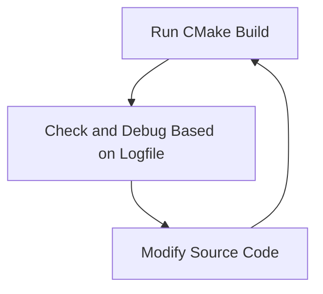

# CWA-MPAS

# ✅ MPAS-JEDI 測試與 MPI 效能優化 To-do List

## 🔄 短期任務（立即可執行）

| 狀態 | 任務內容 | 負責人 | 備註 |
|------|----------|--------|------|
| ⏳ | 釐清亦安使用的 OpenMPI 架構與安裝流程 | 陳登舜、正欽 | 包含 spack 安裝細節 |
| ⏳ | 嘗試依照亦安的架構編譯 MPAS-JEDI | Ting-Chi Wu |  |
| ⏳ | 在 HPC 上執行 MPAS-JEDI，初步估算效能 | 陳登舜 | 可與之前 MPICH 結果對比 |
| ⏳ | 協助理解亦安的設定與方法 | 正欽 | 與登舜協作說明給 Ting-Chi Wu |
| ⏳ | 若需要登入 Fugaku，協助安排筆電操作時間 | Ting-Chi Wu | 登舜使用 Ting-Chi 的筆電登入 Fugaku |

---

## 🔍 中期任務（同步進行的研究/技術驗證）

| 狀態 | 任務內容 | 負責人 | 備註 |
|------|----------|--------|------|
| ⏳ | 研究通用 MPI（如 MPICH）在 FX1000 上的可行性 | 陳登舜 | 嘗試復原當年未走這條路的原因 |
| ⏳ | 比較 FJMPI 與其他 MPI（OpenMPI/MPICH）在 FX1000 上的效能差異 | 陳登舜 | 形成效能比較報告或評估依據 |
| ⏳ | 收集 Fugaku 上的 MPI 實作與優化資料 | Ting-Chi Wu | 若可能從 RIKEN 取得或觀察現行實作 |

---

## 📌 長期方向（策略性目標）

| 狀態 | 任務內容 | 備註 |
|------|----------|------|
| ⏳ | 保持 MPAS-JEDI 系統的**跨平台適應性** | 容器技術尚未突破效能瓶頸前，是重要原則 |
| ⏳ | 評估未來是否需要導入 FJMPI 或等效解法來提升效能 | 根據目前測試結果決定 |


# 🔧 Debugging Cycle Guide

## 🛠 Step-by-Step

### 1. Run CMake Build
```bash
./00_cmk.sh 2>&1 | tee log.cmake_dschen
```

### 2. Check & Debug
Review the generated `log.cmake_dschen` logfile for errors or issues.

### 3. Modify Source Code
Edit the relevant files under the `code/` directory.

---

## 🔁 Debugging Cycle Flowchart


---

# 🧰 Modifications & Fixes

## ❗ OOPS

### 1. Remove Unsupported Intel Flag `-ip`
```bash
cd code/
grep -rn --include='*cmake' '\-ip' .
find . -name '*.cmake' -exec sed -i 's/ -ip /  /g' {} +
```

### 2. `f_c_string` Conflict in `iso_c_binding`
#### Original
```fortran
use, intrinsic :: iso_c_binding
```
#### Workaround
```fortran
use, intrinsic :: iso_c_binding, only: c_int, c_double, c_bool, c_char, c_ptr, c_double_complex, &
                                        c_null_char, c_loc, c_f_pointer, c_associated
```

---

## 📦 IODA

### 1. `f_c_string` Conflict
📍 Location:  
`/home/cwa/tingchi/mpas_bundle_v3/code/ioda/src/obsspace_mod.F90`

### 2. Narrowing Conversion Error
📍 Location:  
`/home/cwa/tingchi/mpas_bundle_v3/code/ufo/src/ufo/filters/ConventionalProfileProcessingParameters.h`

#### Original
```cpp
oops::Parameter<float> AvgP_GapLogPDiffMin {"AvgP_GapLogPDiffMin", std::log(5.0), this};
```

#### Workaround
```cpp
oops::Parameter<float> AvgP_GapLogPDiffMin {"AvgP_GapLogPDiffMin", std::log(5.0f), this};
```

---

## 🌐 MPAS

### 1. Remove Incompatible `icx` Flags `-threads` and `-cxxlib`
#### Root Cause:
ESMF introduces these flags in `link.txt`. Since ESMF is not needed, comment out its inclusion.

#### Diff Patch
```diff
diff --git a/CMakeLists.txt b/CMakeLists.txt
index 70a99b2..f446985 100644
--- a/CMakeLists.txt
+++ b/CMakeLists.txt
@@ -62,7 +62,7 @@ ecbuild_bundle( PROJECT ufo       GIT "https://github.com/JCSDA/ufo.git"

 # Find external ESMF for mpas-model (optional)
-find_package(ESMF 8.3.0 MODULE)
+#find_package(ESMF 8.3.0 MODULE)

 set(MPAS_DOUBLE_PRECISION "ON" CACHE STRING "MPAS-Model: Use double precision 64-bit Floating point.")
 set(MPAS_CORES init_atmosphere atmosphere CACHE STRING "MPAS-Model: cores to build.")
```

---

## 🧪 mpas-jedi

### 1. Remove Incompatible `icx` Flags
Same root cause as MPAS: ESMF brings `-threads` and `-cxxlib`.

---

# ✅ Run CTest

### 1. How to Run?
```bash
nohup ./run_ctest.sh &
```

### 2. Check Results
Review logs under:
```
log/log.ctest.<PKG>
```

